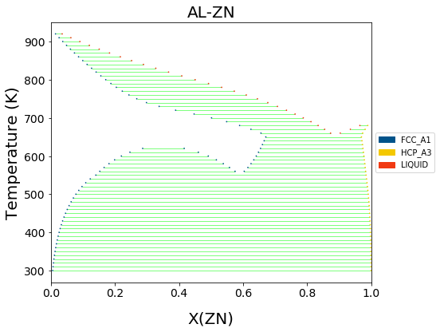
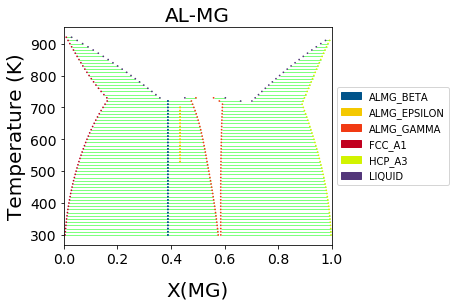
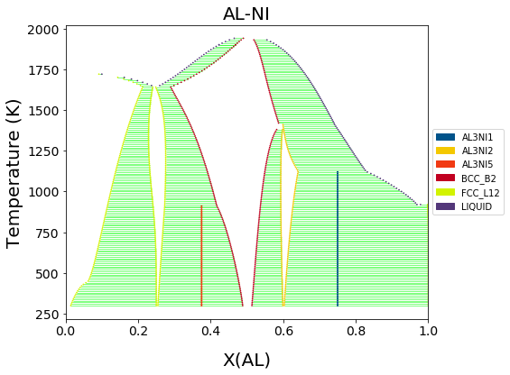
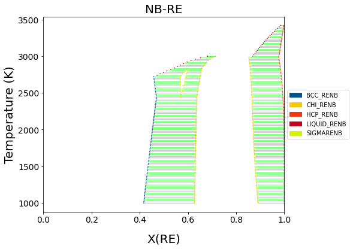
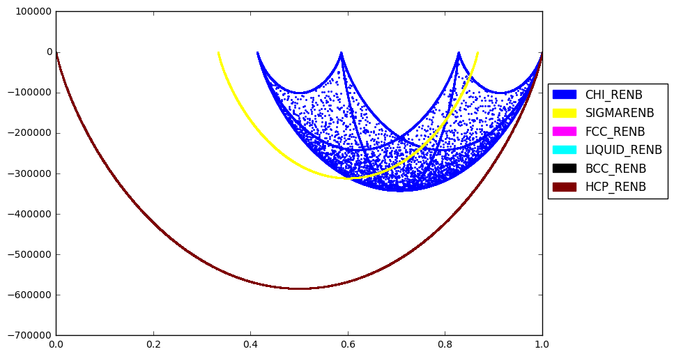

Plotting Isobaric Binary Phase Diagrams with ``binplot``
========================================================

These are a few examples of how to use Thermo-Calc TDB files to
calculate isobaric binary phase diagrams. As long as the TDB file is
present, each cell in these examples is self contained and can
completely reproduce the figure shown.

binplot
~~~~~~~

The phase diagrams are computed with ``binplot``, which has four
required arguments: 1. The Database object 2. A list of active
components (vacancies (``VA``), which are present in many databases,
must be included explictly). 3. A list of phases to consider in the
calculation 4. A dictionary conditions to consider, with keys of
pycalphad StateVariables and values of scalars, 1D arrays, or
``(start, stop, step)`` ranges

Note that, at the time of writing, invariant reactions (three-phase
‘regions’ on binary diagrams) are not yet automatically detected so they
are not drawn on the diagram.

Also note that the `magic
variable <https://ipython.readthedocs.io/en/stable/interactive/magics.html>`__
``%matplotlib inline`` should only be used in Jupyter notebooks.

TDB files
~~~~~~~~~

The TDB files should be located in the current working directory of the
notebook. If you are running using a Jupyter notebook, the default
working directory is the directory that that notebook is saved in.

To check the working directory, run:

.. code:: python

   import os
   print(os.path.abspath(os.curdir))

TDB files can be found in the literature. The `Thermodynamic DataBase
DataBase <https://avdwgroup.engin.brown.edu>`__ (TDBDB) has indexed many
available databases and links to the original papers and/or TDB files
where possible.

Al-Zn (S. Mey, 1993)
--------------------

The miscibility gap in the fcc phase is included in the Al-Zn diagram,
shown below.

The format for specifying a range of a state variable is (*start*,
*stop*, *step*).

S. an Mey, Zeitschrift für Metallkunde 84(7) (1993) 451-455.

.. code:: ipython3

    %matplotlib inline
    import matplotlib.pyplot as plt
    from pycalphad import Database, binplot
    import pycalphad.variables as v
    
    # Load database and choose the phases that will be considered
    db_alzn = Database('alzn_mey.tdb')
    my_phases_alzn = ['LIQUID', 'FCC_A1', 'HCP_A3']
    
    # Create a matplotlib Figure object and get the active Axes
    fig = plt.figure(figsize=(9,6))
    axes = fig.gca()
    
    # Compute the phase diagram and plot it on the existing axes using the `plot_kwargs={'ax': axes}` keyword argument
    binplot(db_alzn, ['AL', 'ZN', 'VA'] , my_phases_alzn, {v.X('ZN'):(0,1,0.02), v.T: (300, 1000, 10), v.P:101325, v.N: 1}, plot_kwargs={'ax': axes})
    
    plt.show()

Al-Mg (Y. Zhong, 2005)
----------------------

Y. Zhong, M. Yang, Z.-K. Liu, CALPHAD 29 (2005) 303-311
doi:\ `10.1016/j.calphad.2005.08.004 <https://doi.org/10.1016/j.calphad.2005.08.004>`__

.. code:: ipython3

    %matplotlib inline
    import matplotlib.pyplot as plt
    from pycalphad import Database, binplot
    import pycalphad.variables as v
    
    # Load database 
    dbf = Database('Al-Mg_Zhong.tdb')
    # Define the components
    comps = ['AL', 'MG', 'VA']
    # Get all possible phases programmatically
    phases = dbf.phases.keys()
    
    # Plot the phase diagram, if no axes are supplied, a new figure with axes will be created automatically
    binplot(dbf, comps, phases, {v.N: 1, v.P:101325, v.T: (300, 1000, 10), v.X('MG'):(0, 1, 0.02)})
    
    plt.show()

Al-Ni (Dupin, 2001)
-------------------

Components and conditions can also be stored as variables and passed to
binplot.

N. Dupin, I. Ansara, B. Sundman, CALPHAD 25(2) (2001) 279-298
doi:\ `10.1016/S0364-5916(01)00049-9 <https://doi.org/10.1016/S0364-5916(01)00049-9>`__

.. code:: ipython3

    %matplotlib inline
    import matplotlib.pyplot as plt
    from pycalphad import Database, binplot
    import pycalphad.variables as v
    
    # Load database
    dbf = Database('NI_AL_DUPIN_2001.TDB')
    # Set the components to consider, including vacanies (VA) explictly.
    comps = ['AL', 'NI', 'VA']
    # Get all the phases in the database programatically
    phases = list(dbf.phases.keys())
    # Create the dictionary of conditions
    conds = {
        v.N: 1, v.P: 101325,
        v.T: (300, 2000, 10),  # (start, stop, step)
        v.X('AL'): (1e-5, 1, 0.02),   # (start, stop, step)
    }
    
    # Create a matplotlib Figure object and get the active Axes
    fig = plt.figure(figsize=(9,6))
    axes = fig.gca()
    
    # Plot by passing in all the variables
    binplot(dbf, comps, phases, conds, plot_kwargs={'ax': axes})
    
    plt.show()

Al-Fe (M. Seiersten, 1991)
--------------------------

Removing tielines

.. code:: ipython3

    %matplotlib inline
    import matplotlib.pyplot as plt
    from pycalphad import Database, binplot
    import pycalphad.variables as v
    
    # Load database and choose the phases that will be considered
    db_alfe = Database('alfe_sei.TDB')
    my_phases_alfe = ['LIQUID', 'B2_BCC', 'FCC_A1', 'HCP_A3', 'AL5FE2', 'AL2FE', 'AL13FE4', 'AL5FE4']
    
    # Create a matplotlib Figure object and get the active Axes
    fig = plt.figure(figsize=(9,6))
    axes = fig.gca()
    
    # Plot the phase diagram on the existing axes using the `plot_kwargs={'ax': axes}` keyword argument
    # Tielines are turned off by including `'tielines': False` in the plotting keword argument
    binplot(db_alfe, ['AL', 'FE', 'VA'] , my_phases_alfe, {v.X('AL'):(0,1,0.01), v.T: (300, 2000, 10), v.P:101325}, plot_kwargs={'ax': axes, 'tielines': False})
    
    plt.show()

.. image:: BinaryExamples_files/BinaryExamples_10_0.png

Nb-Re (Liu, 2013)
-----------------

X.L. Liu, C.Z. Hargather, Z.-K. Liu, CALPHAD 41 (2013) 119-127
doi:\ `10.1016/j.calphad.2013.02.006 <https://doi.org/10.1016/j.calphad.2013.02.006>`__

.. code:: ipython3

    %matplotlib inline
    import matplotlib.pyplot as plt
    from pycalphad import Database, binplot, variables as v
    
    # Load database and choose the phases that will be plotted
    db_nbre = Database('nbre_liu.tdb')
    my_phases_nbre = ['CHI_RENB', 'SIGMARENB', 'FCC_RENB', 'LIQUID_RENB', 'BCC_RENB', 'HCP_RENB']
    
    # Create a matplotlib Figure object and get the active Axes
    fig = plt.figure(figsize=(9,6))
    axes = fig.gca()
    
    # Plot the phase diagram on the existing axes using the `plot_kwargs={'ax': axes}` keyword argument
    binplot(db_nbre, ['NB', 'RE'] , my_phases_nbre, {v.X('RE'): (0,1,0.01), v.T: (1000, 3500, 20), v.P:101325}, plot_kwargs={'ax': axes})
    
    axes.set_xlim(0, 1)
    plt.show()

Calculating Energy Surfaces of Binary Systems
=============================================

It is very common in CALPHAD modeling to directly examine the Gibbs
energy surface of all the constituent phases in a system.

Below we show how the Gibbs energy of all phases may be calculated as a
function of composition at a given temperature (2800 K).

Note that the chi phase has additional, internal degrees of freedom
which allow it to take on multiple states for a given overall
composition. Only the low-energy states are relevant to calculating the
equilibrium phase diagram.

.. code:: ipython3

    %matplotlib inline
    import matplotlib.pyplot as plt
    from pycalphad import Database, calculate, variables as v
    from pycalphad.plot.utils import phase_legend
    import numpy as np
    
    # Load database and choose the phases that will be plotted
    db_nbre = Database('nbre_liu.tdb')
    my_phases_nbre = ['CHI_RENB', 'SIGMARENB', 'FCC_RENB', 'LIQUID_RENB', 'BCC_RENB', 'HCP_RENB']
    
    # Get the colors that map phase names to colors in the legend
    legend_handles, color_dict = phase_legend(my_phases_nbre)
    
    fig = plt.figure(figsize=(9,6))
    ax = fig.gca()
    
    # Loop over phases, calculate the Gibbs energy, and scatter plot GM vs. X(RE)
    for phase_name in my_phases_nbre:
        result = calculate(db_nbre, ['NB', 'RE'], phase_name, P=101325, T=2800, output='GM')
        ax.scatter(result.X.sel(component='RE'), result.GM, marker='.', s=5, color=color_dict[phase_name])
    
    # Format the plot
    ax.set_xlabel('X(RE)')
    ax.set_ylabel('GM')
    ax.set_xlim((0, 1))
    ax.legend(handles=legend_handles, loc='center left', bbox_to_anchor=(1, 0.6))
    plt.show()

