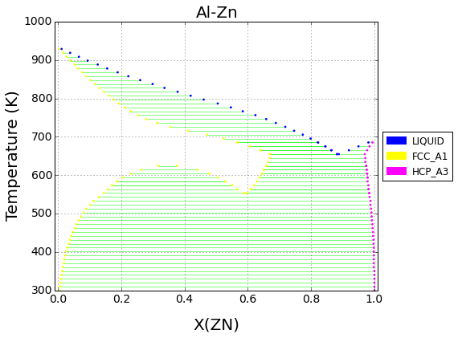
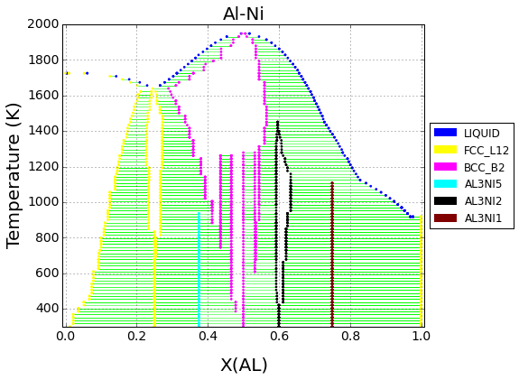
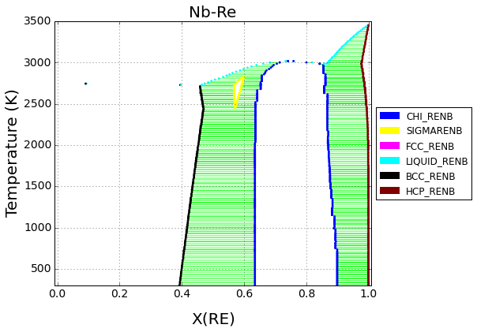
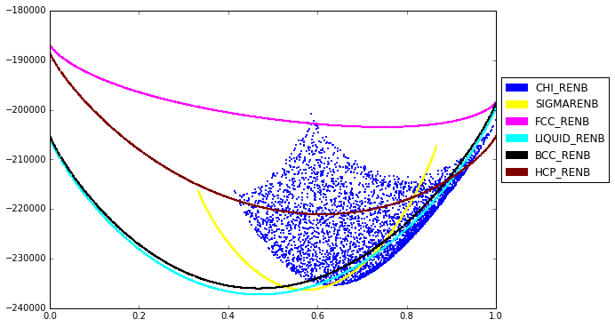

Calculating Isobaric Binary Phase Diagrams
==========================================

These are a few examples of how to use Thermo-Calc TDB files to
calculate isobaric binary phase diagrams.

Note that, at the time of writing, invariant reactions (three-phase
'regions' on binary diagrams) are not yet automatically detected so they
are not drawn on the diagram.

.. code:: python

    %matplotlib inline
    import matplotlib.pyplot as plt
    from pycalphad import Database, binplot

Al-Zn (S. Mey, 1993)
====================

The miscibility gap in the fcc phase is included in the Al-Zn diagram,
shown below.

.. code:: python

    db_alzn = Database('alzn_mey.tdb')
    my_phases_alzn = ['LIQUID', 'FCC_A1', 'HCP_A3']
    fig = plt.figure(figsize=(9,6))
    %time ax = binplot(db_alzn, ['AL', 'ZN', 'VA'] , my_phases_alzn, 'X(ZN)', 300, 1000, ax=plt.gca())

.. parsed-literal::

    CPU times: user 1.53 s, sys: 40 ms, total: 1.57 s
    Wall time: 1.57 s

Al-Fe (M.Seiersten et al., 1991)
================================

.. code:: python

    db_alfe = Database('alfe_sei.TDB')
    my_phases_alfe = ['LIQUID', 'B2_BCC', 'FCC_A1', 'HCP_A3', 'AL5FE2', 'AL2FE', 'AL13FE4', 'AL5FE4']
    
    fig = plt.figure(figsize=(9,6))
    pdens = [{'B2_BCC': 20000}, 2000]
    %time binplot(db_alfe, ['AL', 'FE', 'VA'] , my_phases_alfe, 'X(AL)', 300, 2000, steps=100, pdens=pdens, ax=fig.gca())
    plt.show()

.. parsed-literal::

    CPU times: user 40.1 s, sys: 3.6 s, total: 43.7 s
    Wall time: 42.1 s

.. image:: BinaryExamples_files/BinaryExamples_7_1.png

Al-Ni (Work in progress) (N. Dupin et al., 2001)
================================================

.. code:: python

    db_alni = Database('NI_AL_DUPIN_2001.TDB')
    my_phases_alni = ['LIQUID', 'FCC_L12', 'BCC_B2', 'AL3NI5', 'AL3NI2', 'AL3NI1']
    fig = plt.figure(figsize=(9,6))
    pdens = [{'BCC_B2': 5000}, 2000]
    %time ax = binplot(db_alni, ['AL', 'NI', 'VA'] , my_phases_alni, 'X(AL)', 300.0, 2000.0, steps=100, pdens=pdens, ax=fig.gca())

.. parsed-literal::

    CPU times: user 1min 3s, sys: 9.34 s, total: 1min 12s
    Wall time: 1min 10s

.. code:: python

    from pycalphad import calculate
    from pycalphad.plot.utils import phase_legend
    import numpy as np
    
    legend_handles, colorlist = phase_legend(my_phases_alni)
    
    fig = plt.figure(figsize=(9,6))
    ax = fig.gca()
    for name in my_phases_alni:
        result = calculate(db_alni, ['AL', 'NI', 'VA'], name, T=1000, output='GM')
        ax.scatter(result.X.sel(component='AL'), result.GM,
                   marker='.', s=5, color=colorlist[name.upper()])
    ax.set_xlim((0, 1))
    ax.legend(handles=legend_handles, loc='center left', bbox_to_anchor=(1, 0.6))
    plt.show()

.. image:: BinaryExamples_files/BinaryExamples_10_0.png

Nb-Re (X. L. Liu et al., 2013)
==============================

.. code:: python

    db_nbre = Database('nbre_liu.tdb')
    my_phases_nbre = ['CHI_RENB', 'SIGMARENB', 'FCC_RENB', 'LIQUID_RENB', 'BCC_RENB', 'HCP_RENB']
    fig = plt.figure(figsize=(9,6))
    # chi phase needs extra point density to get smooth boundaries; everything else can be low
    pdens = [{'CHI_RENB':4000}, 2000]
    %time ax = binplot(db_nbre, ['NB', 'RE'] , my_phases_nbre, 'X(RE)', 300, 3500, steps=200, pdens=pdens, ax=fig.gca())

.. parsed-literal::

    CPU times: user 9.42 s, sys: 1.47 s, total: 10.9 s
    Wall time: 10.1 s

Calculating Energy Surfaces of Binary Systems
=============================================

It is very common in CALPHAD modeling to directly examine the Gibbs
energy surface of all the constituent phases in a system.

Below we show how the Gibbs energy of all phases may be calculated as a
function of composition at a given temperature (2800 K).

Note that the chi phase has additional, internal degrees of freedom
which allow it to take on multiple states for a given overall
composition. Only the low-energy states are relevant to calculating the
equilibrium phase diagram.

In the future this code will be rolled into a pycalphad routine so that
it is simpler for the user.

.. code:: python

    from pycalphad import calculate
    from pycalphad.plot.utils import phase_legend
    import numpy as np
    
    legend_handles, colorlist = phase_legend(my_phases_nbre)
    
    fig = plt.figure(figsize=(9,6))
    ax = fig.gca()
    for name in my_phases_nbre:
        result = calculate(db_nbre, ['NB', 'RE'], name, T=2800, output='GM')
        ax.scatter(result.X.sel(component='RE'), result.GM,
                   marker='.', s=5, color=colorlist[name.upper()])
    ax.set_xlim((0, 1))
    ax.legend(handles=legend_handles, loc='center left', bbox_to_anchor=(1, 0.6))
    plt.show()

