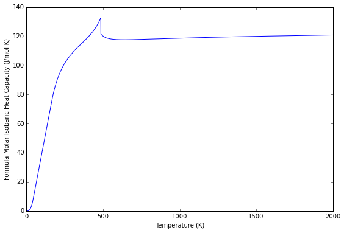
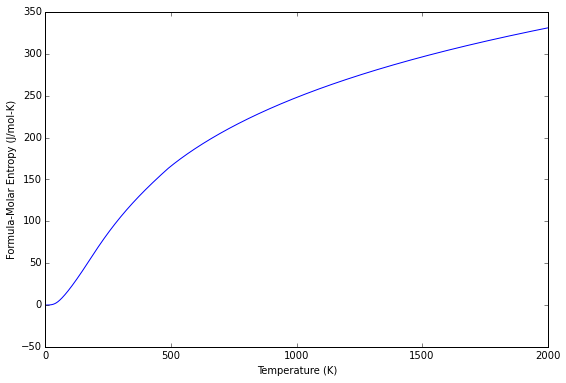

Thermodynamic Calculation of Cementite (:math:`Fe_3C`)
======================================================

Bengt Hallstedt, Dejan Djurovic, Jörg von Appen, Richard Dronskowski, Alexey Dick, Fritz Körmann, Tilmann Hickel, Jörg Neugebauer, Thermodynamic properties of cementite, Calphad, Volume 34, Issue 1, March 2010, Pages 129-133, ISSN 0364-5916, http://dx.doi.org/10.1016/j.calphad.2010.01.004. (http://www.sciencedirect.com/science/article/pii/S0364591610000052)
=======================================================================================================================================================================================================================================================================================================================================================================

The TDB file used here differs slightly from the published TDB to ensure
compatibility with pycalphad's TDB parser. All phases except cementite
are omitted. The numerical results should be the same.

.. code:: python

    TDB = """
     ELEMENT C    GRAPHITE                   12.011     1054.0      5.7423 ! 
     ELEMENT FE   BCC_A2                     55.847     4489.0     27.2797 ! 
     TYPE_DEFINITION % SEQ * !
     TYPE_DEFINITION A GES AMEND_PHASE_DESCRIPTION @ MAGNETIC -3 0.28 !
     PHASE CEMENTITE_D011 %A 2 3 1 !
     CONSTITUENT CEMENTITE_D011 : FE : C : !
     PARAMETER  G(CEMENTITE_D011,FE:C;0) 0.01 +GFECEM; 6000 N !
     PARAMETER  TC(CEMENTITE_D011,FE:C;0) 0.01 485.00; 6000 N !
     PARAMETER  BMAGN(CEMENTITE_D011,FE:C;0) 0.01 1.008; 6000 N !
     FUNCTION GFECEM      0.01  +11369.937746-5.641259263*T-8.333E-6*T**4;
            43.00  Y  +11622.647246-59.537709263*T+15.74232*T*LN(T)
           -0.27565*T**2;
           163.00  Y  -10195.860754+690.949887637*T-118.47637*T*LN(T)
                      -0.0007*T**2+590527*T**(-1);
          6000.00  N !
    """

Do some initial setup, including reading the database.

.. code:: python

    %matplotlib inline
    import matplotlib.pyplot as plt
    from matplotlib.pyplot import rcParams
    rcParams['figure.figsize'] = 9, 6
    import numpy as np
    from pycalphad import Database, calculate
    import pycalphad.variables as v
    
    db = Database(TDB)

Compute the molar heat capacity at all temperatures from 1K to 2000K
with a step size of 0.5K.

.. code:: python

    result = calculate(db, ['FE', 'C'], 'CEMENTITE_D011', T=(1, 2000, 0.5), output='CPM')

.. code:: python

    # Note: 4 moles of atoms per formula unit (Fe3C1). That's why we multiply times 4
    plt.xlabel('Temperature (K)')
    plt.ylabel('Formula-Molar Isobaric Heat Capacity (J/mol-K)')
    plt.plot(result['T'], 4.0 * result['CPM'])
    plt.show()

.. code:: python

    result = calculate(db, ['FE', 'C'], 'CEMENTITE_D011', T=(1, 2000, 0.5), output='SM')

.. code:: python

    plt.xlabel('Temperature (K)')
    plt.ylabel('Formula-Molar Entropy (J/mol-K)')
    plt.plot(result['T'], 4.0 * result['SM'])
    plt.show()

