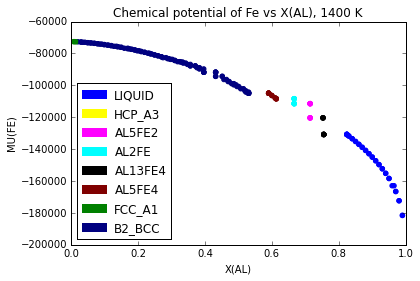
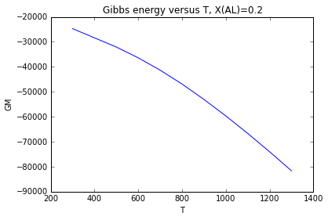

Computing Multi-Phase Equilibria
================================

.. code-block:: python

    from pycalphad import equilibrium, calculate
    from pycalphad import Database, Model
    import pycalphad.variables as v

.. code-block:: python

    db_alfe = Database('alfe_sei.TDB')
    my_phases_alfe = ['LIQUID', 'HCP_A3', 'AL5FE2', 'AL2FE', 'AL13FE4', 'AL5FE4', 'FCC_A1', 'B2_BCC']

.. code-block:: python

    %time eq = equilibrium(db_alfe, ['AL', 'FE', 'VA'], my_phases_alfe, {v.X('AL'): (0.01,1,0.01), v.T: 1400.})
    print(eq)

.. parsed-literal::

    Components: AL FE VA
    Phases: AL13FE4 AL2FE AL5FE2 AL5FE4 B2_BCC FCC_A1 HCP_A3 LIQUID [done]
    Computing initial grid [100 points, 10.1KB]
    Computing convex hull [iteration 1]
    progress 6.919479062432842e+264
    Refining convex hull
    Rebuilding grid [1288 points, 128.9KB]
    Computing convex hull [iteration 2]
    progress 18136.0635728896
    Refining convex hull
    Rebuilding grid [2476 points, 247.7KB]
    Computing convex hull [iteration 3]
    progress 12398.310789027804
    Refining convex hull
    Rebuilding grid [3664 points, 366.5KB]
    Computing convex hull [iteration 4]
    progress 4774.671408329887
    Refining convex hull
    Rebuilding grid [4852 points, 485.3KB]
    Computing convex hull [iteration 5]
    progress 2869.6625271142693
    Refining convex hull
    Rebuilding grid [6040 points, 604.1KB]
    Computing convex hull [iteration 6]
    progress 1328.7444867699523
    Refining convex hull
    Rebuilding grid [7228 points, 722.9KB]
    Computing convex hull [iteration 7]
    progress 1196.3957630854566
    Refining convex hull
    Rebuilding grid [8416 points, 841.7KB]
    Computing convex hull [iteration 8]
    progress 355.4894321720494
    Refining convex hull
    Rebuilding grid [9604 points, 960.5KB]
    Computing convex hull [iteration 9]
    progress 3965.3133642926405
    Refining convex hull
    Rebuilding grid [10792 points, 1.1MB]
    Computing convex hull [iteration 10]
    progress 4022.4030851136195
    Refining convex hull
    Rebuilding grid [11980 points, 1.2MB]
    Computing convex hull [iteration 11]
    progress 1689.4360394445685
    Refining convex hull
    Rebuilding grid [13168 points, 1.3MB]
    Computing convex hull [iteration 12]
    progress 1033.8942243782367
    Refining convex hull
    Rebuilding grid [14356 points, 1.4MB]
    Computing convex hull [iteration 13]
    progress 536.562420531016
    Refining convex hull
    Rebuilding grid [15544 points, 1.6MB]
    Computing convex hull [iteration 14]
    progress 6.770465075765969
    Refining convex hull
    Rebuilding grid [16732 points, 1.7MB]
    Computing convex hull [iteration 15]
    progress 322.70844054246845
    Refining convex hull
    Rebuilding grid [17920 points, 1.8MB]
    Computing convex hull [iteration 16]
    progress 1309.6535941438487
    Refining convex hull
    Rebuilding grid [19108 points, 1.9MB]
    Computing convex hull [iteration 17]
    progress 591.7283829172084
    Refining convex hull
    Rebuilding grid [20296 points, 2.0MB]
    Computing convex hull [iteration 18]
    progress 734.5058100457827
    Refining convex hull
    Rebuilding grid [21484 points, 2.1MB]
    Computing convex hull [iteration 19]
    progress 593.326853620878
    Refining convex hull
    Rebuilding grid [22672 points, 2.3MB]
    Computing convex hull [iteration 20]
    progress 417.6534645179636
    Refining convex hull
    Rebuilding grid [23860 points, 2.4MB]
    Computing convex hull [iteration 21]
    progress 582.7132862557628
    Refining convex hull
    Rebuilding grid [25048 points, 2.5MB]
    Computing convex hull [iteration 22]
    progress 24.425667321120272
    Refining convex hull
    Rebuilding grid [26236 points, 2.6MB]
    Computing convex hull [iteration 23]
    progress 168.37540945698856
    Refining convex hull
    Rebuilding grid [27424 points, 2.7MB]
    Computing convex hull [iteration 24]
    progress 70.47358547976182
    Refining convex hull
    Rebuilding grid [28612 points, 2.9MB]
    Computing convex hull [iteration 25]
    progress 289.71260010766855
    Refining convex hull
    Rebuilding grid [29800 points, 3.0MB]
    Computing convex hull [iteration 26]
    progress 0.17423804507416207
    Refining convex hull
    Rebuilding grid [30988 points, 3.1MB]
    Computing convex hull [iteration 27]
    progress 0.15504221434821375
    Refining convex hull
    Rebuilding grid [32176 points, 3.2MB]
    Computing convex hull [iteration 28]
    progress 0.16398512502200902
    Refining convex hull
    Rebuilding grid [33364 points, 3.3MB]
    Computing convex hull [iteration 29]
    progress 0.10938297610846348
    Refining convex hull
    Rebuilding grid [34552 points, 3.5MB]
    Computing convex hull [iteration 30]
    progress 0.15455805489909835
    Refining convex hull
    Rebuilding grid [35740 points, 3.6MB]
    Computing convex hull [iteration 31]
    progress 0.11221598183328751
    Refining convex hull
    Rebuilding grid [36928 points, 3.7MB]
    Computing convex hull [iteration 32]
    progress 0.19503661853377707
    Refining convex hull
    Rebuilding grid [38116 points, 3.8MB]
    Computing convex hull [iteration 33]
    progress 0.254199706192594
    Refining convex hull
    Rebuilding grid [39304 points, 3.9MB]
    Computing convex hull [iteration 34]
    progress 0.19052308006212115
    Refining convex hull
    Rebuilding grid [40492 points, 4.0MB]
    Computing convex hull [iteration 35]
    progress 0.13730663209571503
    Refining convex hull
    Rebuilding grid [41680 points, 4.2MB]
    Computing convex hull [iteration 36]
    progress 206.25392844175803
    Refining convex hull
    Rebuilding grid [42868 points, 4.3MB]
    Computing convex hull [iteration 37]
    progress 0.1080305502837291
    Refining convex hull
    Rebuilding grid [44056 points, 4.4MB]
    Computing convex hull [iteration 38]
    progress 0.08953624273999594
    Refining convex hull
    Rebuilding grid [45244 points, 4.5MB]
    Computing convex hull [iteration 39]
    progress 0.11052689151256345
    Refining convex hull
    Rebuilding grid [46432 points, 4.6MB]
    Computing convex hull [iteration 40]
    progress 0.062142628885339946
    Refining convex hull
    Rebuilding grid [47620 points, 4.8MB]
    Computing convex hull [iteration 41]
    progress 0.11962676084658597
    Refining convex hull
    Rebuilding grid [48808 points, 4.9MB]
    Computing convex hull [iteration 42]
    progress 0.05998564873880241
    Refining convex hull
    Rebuilding grid [49996 points, 5.0MB]
    Computing convex hull [iteration 43]
    progress 0.08374080076464452
    Refining convex hull
    Rebuilding grid [51184 points, 5.1MB]
    Computing convex hull [iteration 44]
    progress 0.07556327022030018
    Refining convex hull
    Rebuilding grid [52372 points, 5.2MB]
    Computing convex hull [iteration 45]
    progress 0.03699067252455279
    Refining convex hull
    Rebuilding grid [53560 points, 5.4MB]
    Computing convex hull [iteration 46]
    progress 0.03610779898008332
    Refining convex hull
    Rebuilding grid [54748 points, 5.5MB]
    Computing convex hull [iteration 47]
    progress 0.01810319855576381
    Refining convex hull
    Rebuilding grid [55936 points, 5.6MB]
    Computing convex hull [iteration 48]
    progress 0.04567314186715521
    Refining convex hull
    Rebuilding grid [57124 points, 5.7MB]
    Computing convex hull [iteration 49]
    progress 0.1361084642703645
    Refining convex hull
    Rebuilding grid [58312 points, 5.8MB]
    Computing convex hull [iteration 50]
    progress 0.060178296524100006
    Refining convex hull
    Rebuilding grid [59500 points, 6.0MB]
    Computing convex hull [iteration 51]
    progress 0.03788498943322338
    Refining convex hull
    Rebuilding grid [60688 points, 6.1MB]
    Computing convex hull [iteration 52]
    progress 0.03654990458744578
    Refining convex hull
    Rebuilding grid [61876 points, 6.2MB]
    Computing convex hull [iteration 53]
    progress 0.10846757580293342
    Refining convex hull
    Rebuilding grid [63064 points, 6.3MB]
    Computing convex hull [iteration 54]
    progress 0.07677628053352237
    Refining convex hull
    Rebuilding grid [64252 points, 6.4MB]
    Computing convex hull [iteration 55]
    progress 0.11841258194181137
    Refining convex hull
    Rebuilding grid [65440 points, 6.5MB]
    Computing convex hull [iteration 56]
    progress 0.06058756267884746
    Refining convex hull
    Rebuilding grid [66628 points, 6.7MB]
    Computing convex hull [iteration 57]
    progress 0.09772531015914865
    Refining convex hull
    Rebuilding grid [67816 points, 6.8MB]
    Computing convex hull [iteration 58]
    progress 0.043622974917525426
    Refining convex hull
    Rebuilding grid [69004 points, 6.9MB]
    Computing convex hull [iteration 59]
    progress 0.08694580840528943
    Refining convex hull
    Rebuilding grid [70192 points, 7.0MB]
    Computing convex hull [iteration 60]
    progress 0.0
    Convergence achieved
    CPU times: user 7min 19s, sys: 18.6 s, total: 7min 38s
    Wall time: 7min 37s
    <xray.Dataset>
    Dimensions:       (T: 1, X_AL: 99, component: 2, internal_dof: 5, vertex: 2)
    Coordinates:
      * T             (T) float64 1.4e+03
      * X_AL          (X_AL) float64 0.01 0.02 0.03 0.04 0.05 0.06 0.07 0.08 ...
      * vertex        (vertex) int64 0 1
      * component     (component) object 'AL' 'FE'
      * internal_dof  (internal_dof) int64 0 1 2 3 4
    Data variables:
        NP            (T, X_AL, vertex) float64 0.8616 0.1384 0.8626 0.1374 ...
        GM            (T, X_AL) float64 -7.38e+04 -7.496e+04 -7.608e+04 ...
        MU            (T, X_AL, component) float64 -1.947e+05 -7.258e+04 ...
        X             (T, X_AL, vertex, component) float64 0.01036 0.9896 ...
        Y             (T, X_AL, vertex, internal_dof) float64 0.01036 0.9896 1.0 ...
        Phase         (T, X_AL, vertex) object 'FCC_A1' 'FCC_A1' 'B2_BCC' ...
    Attributes:
        iterations: 60

.. code-block:: python

    %matplotlib inline
    import matplotlib.pyplot as plt
    from pycalphad.plot.utils import phase_legend
    plt.gca().set_xlim((0,1))
    plt.gca().set_title('Chemical potential of Fe vs X(AL), 1400 K')
    plt.gca().set_xlabel('X(AL)')
    plt.gca().set_ylabel('MU(FE)')
    phase_handles, phasemap = phase_legend(my_phases_alfe)
    phasecolors = [phasemap[str(p.values)] for p in eq.Phase.sel(T=1400, vertex=0)]
    plt.scatter(eq.X.sel(T=1400, component='AL', vertex=0), eq.MU.sel(T=1400, component='FE'), color=phasecolors)
    phasecolors = [phasemap[str(p.values)] for p in eq.Phase.sel(T=1400, vertex=1)]
    plt.scatter(eq.X.sel(T=1400, component='AL', vertex=1), eq.MU.sel(T=1400, component='FE'), color=phasecolors)
    plt.gca().legend(phase_handles, my_phases_alfe, loc='lower left')

.. parsed-literal::

    <matplotlib.legend.Legend at 0x7fc58a06ac88>

.. code-block:: python

    %%time
    eq = equilibrium(db_alfe, ['AL', 'FE', 'VA'], my_phases_alfe,
        {v.X('AL'): 0.2, v.T: (300, 1400, 100)})
    print(eq)

.. parsed-literal::

    Components: AL FE VA
    Phases: AL13FE4 AL2FE AL5FE2 AL5FE4 B2_BCC FCC_A1 HCP_A3 LIQUID [done]
    Computing initial grid [100 points, 102.1KB]
    Computing convex hull [iteration 1]
    progress 127440.16718150636
    Refining convex hull
    Rebuilding grid [112 points, 114.4KB]
    Computing convex hull [iteration 2]
    progress 8654.212608444781
    Refining convex hull
    Rebuilding grid [124 points, 126.6KB]
    Computing convex hull [iteration 3]
    progress 6268.35252851581
    Refining convex hull
    Rebuilding grid [136 points, 138.9KB]
    Computing convex hull [iteration 4]
    progress 6355.910327283316
    Refining convex hull
    Rebuilding grid [148 points, 151.1KB]
    Computing convex hull [iteration 5]
    progress 3244.3730255085393
    Refining convex hull
    Rebuilding grid [160 points, 163.3KB]
    Computing convex hull [iteration 6]
    progress 1524.5514223931677
    Refining convex hull
    Rebuilding grid [172 points, 175.6KB]
    Computing convex hull [iteration 7]
    progress 864.7880344600417
    Refining convex hull
    Rebuilding grid [184 points, 187.8KB]
    Computing convex hull [iteration 8]
    progress 515.0547535463993
    Refining convex hull
    Rebuilding grid [196 points, 200.1KB]
    Computing convex hull [iteration 9]
    progress 563.5826182941528
    Refining convex hull
    Rebuilding grid [208 points, 212.3KB]
    Computing convex hull [iteration 10]
    progress 128.9229354802519
    Refining convex hull
    Rebuilding grid [220 points, 224.5KB]
    Computing convex hull [iteration 11]
    progress 34.961521083823754
    Refining convex hull
    Rebuilding grid [232 points, 236.8KB]
    Computing convex hull [iteration 12]
    progress 17.595617998289526
    Refining convex hull
    Rebuilding grid [244 points, 249.0KB]
    Computing convex hull [iteration 13]
    progress 2.847986740001943
    Refining convex hull
    Rebuilding grid [256 points, 261.3KB]
    Computing convex hull [iteration 14]
    progress 0.0
    Convergence achieved
    <xray.Dataset>
    Dimensions:       (T: 11, X_AL: 1, component: 2, internal_dof: 5, vertex: 2)
    Coordinates:
      * T             (T) float64 300.0 400.0 500.0 600.0 700.0 800.0 900.0 ...
      * X_AL          (X_AL) float64 0.2
      * vertex        (vertex) int64 0 1
      * component     (component) object 'AL' 'FE'
      * internal_dof  (internal_dof) int64 0 1 2 3 4
    Data variables:
        NP            (T, X_AL, vertex) float64 0.1478 0.8522 0.0969 0.9031 ...
        GM            (T, X_AL) float64 -2.47e+04 -2.839e+04 -3.207e+04 ...
        MU            (T, X_AL, component) float64 -7.368e+04 -1.245e+04 ...
        X             (T, X_AL, vertex, component) float64 0.3007 0.6993 0.1825 ...
        Y             (T, X_AL, vertex, internal_dof) float64 0.04563 0.9544 ...
        Phase         (T, X_AL, vertex) object 'B2_BCC' 'B2_BCC' 'B2_BCC' ...
    Attributes:
        iterations: 14
    CPU times: user 2min 29s, sys: 78 ms, total: 2min 29s
    Wall time: 2min 29s

.. code-block:: python

    %matplotlib inline
    import matplotlib.pyplot as plt
    plt.gca().set_title('Gibbs energy versus T, X(AL)=0.2')
    plt.gca().set_xlabel('T')
    plt.gca().set_ylabel('GM')
    plt.plot(eq['T'], eq.GM.sel(X_AL=0.2))

.. parsed-literal::

    [<matplotlib.lines.Line2D at 0x7fc5896b7208>]

