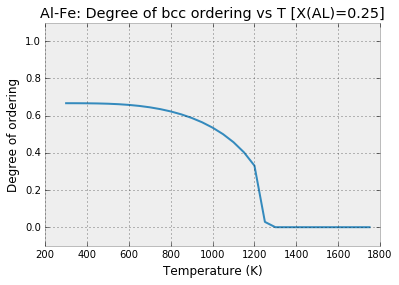
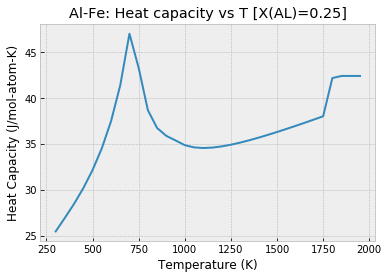
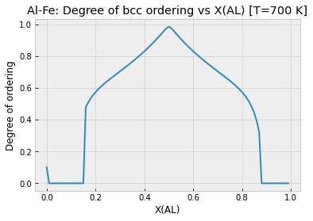
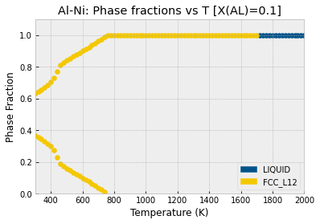
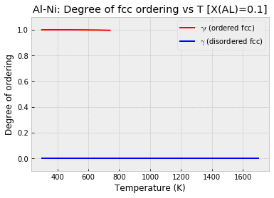

Equilibrium Properties and Partial Ordering (Al-Fe and Al-Ni)
=============================================================

.. code:: ipython3

    # Only needed in a Jupyter Notebook
    %matplotlib inline
    # Optional plot styling
    import matplotlib
    matplotlib.style.use('bmh')

.. code:: ipython3

    import matplotlib.pyplot as plt
    from pycalphad import equilibrium
    from pycalphad import Database, Model
    import pycalphad.variables as v
    import numpy as np

Al-Fe (Heat Capacity and Degree of Ordering)
--------------------------------------------

Here we compute equilibrium thermodynamic properties in the Al-Fe
system. We know that only B2 and liquid are stable in the temperature
range of interest, but we just as easily could have included all the
phases in the calculation using ``my_phases = list(db.phases.keys())``.
Notice that the syntax for specifying a range is ``(min, max, step)``.
We can also directly specify a list of temperatures using the list
syntax, e.g., ``[300, 400, 500, 1400]``.

We explicitly indicate that we want to compute equilibrium values of the
``heat_capacity`` and ``degree_of_ordering`` properties. These are both
defined in the default ``Model`` class. For a complete list, see the
documentation. ``equilibrium`` will always return the Gibbs energy,
chemical potentials, phase fractions and site fractions, regardless of
the value of ``output``.

.. code:: ipython3

    db = Database('alfe_sei.TDB')
    my_phases = ['LIQUID', 'B2_BCC']
    eq = equilibrium(db, ['AL', 'FE', 'VA'], my_phases, {v.X('AL'): 0.25, v.T: (300, 2000, 50), v.P: 101325},
                     output=['heat_capacity', 'degree_of_ordering'])
    print(eq)

.. parsed-literal::

    <xarray.Dataset>
    Dimensions:             (P: 1, T: 34, X_AL: 1, component: 2, internal_dof: 5, vertex: 2)
    Coordinates:
      * P                   (P) float64 1.013e+05
      * T                   (T) float64 300.0 350.0 400.0 450.0 500.0 550.0 ...
      * X_AL                (X_AL) float64 0.25
      * vertex              (vertex) int64 0 1
      * component           (component) <U2 'AL' 'FE'
    Dimensions without coordinates: internal_dof
    Data variables:
        NP                  (P, T, X_AL, vertex) float64 1.0 nan 1.0 nan 1.0 nan ...
        GM                  (P, T, X_AL) float64 -2.858e+04 -2.994e+04 -3.15e+04 ...
        MU                  (P, T, X_AL, component) float64 -7.274e+04 ...
        X                   (P, T, X_AL, vertex, component) float64 0.25 0.75 ...
        Y                   (P, T, X_AL, vertex, internal_dof) float64 0.5 0.5 ...
        Phase               (P, T, X_AL, vertex) <U6 'B2_BCC' '' 'B2_BCC' '' ...
        degree_of_ordering  (P, T, X_AL, vertex) float64 0.6666 nan 0.6665 nan ...
        heat_capacity       (P, T, X_AL) float64 25.45 26.93 28.47 30.18 32.16 ...
    Attributes:
        engine:   pycalphad 0.7+5.g20149e02.dirty
        created:  2018-04-18T19:27:07.389851

We also compute degree of ordering at fixed temperature as a function of
composition.

.. code:: ipython3

    eq2 = equilibrium(db, ['AL', 'FE', 'VA'], 'B2_BCC', {v.X('AL'): (0,1,0.01), v.T: 700, v.P: 101325},
                      output='degree_of_ordering')
    print(eq2)

.. parsed-literal::

    <xarray.Dataset>
    Dimensions:             (N: 1, P: 1, T: 1, X_AL: 100, component: 2, internal_dof: 5, vertex: 3)
    Coordinates:
      * N                   (N) float64 1.0
      * P                   (P) float64 1.013e+05
      * T                   (T) float64 700.0
      * X_AL                (X_AL) float64 1e-12 0.01 0.02 0.03 ... 0.97 0.98 0.99
      * vertex              (vertex) int64 0 1 2
      * component           (component) <U2 'AL' 'FE'
    Dimensions without coordinates: internal_dof
    Data variables:
        NP                  (N, P, T, X_AL, vertex) float64 1.0 nan nan ... nan nan
        GM                  (N, P, T, X_AL) float64 -2.447e+04 ... -1.949e+04
        MU                  (N, P, T, X_AL, component) float64 -2.714e+05 ... -1.444e+05
        X                   (N, P, T, X_AL, vertex, component) float64 1e-12 ... nan
        Y                   (N, P, T, X_AL, vertex, internal_dof) float64 1e-12 ... nan
        Phase               (N, P, T, X_AL, vertex) <U6 'B2_BCC' '' '' ... '' ''
        degree_of_ordering  (N, P, T, X_AL, vertex) float64 3.029e-16 nan ... nan
    Attributes:
        engine:   pycalphad 0.8.3+10.gfd19517e.dirty
        created:  2020-10-27T14:48:18.391819

Plots
~~~~~

Next we plot the degree of ordering versus temperature. We can see that
the decrease in the degree of ordering is relatively steady and
continuous. This is indicative of a second-order transition from
partially ordered B2 to disordered bcc (A2).

.. code:: ipython3

    plt.gca().set_title('Al-Fe: Degree of bcc ordering vs T [X(AL)=0.25]')
    plt.gca().set_xlabel('Temperature (K)')
    plt.gca().set_ylabel('Degree of ordering')
    plt.gca().set_ylim((-0.1,1.1))
    # Generate a list of all indices where B2 is stable
    phase_indices = np.nonzero(eq.Phase.values == 'B2_BCC')
    # phase_indices[2] refers to all temperature indices
    # We know this because pycalphad always returns indices in order like P, T, X's
    plt.plot(np.take(eq['T'].values, phase_indices[2]), eq['degree_of_ordering'].values[phase_indices])
    plt.show()

For the heat capacity curve shown below we notice a sharp increase in
the heat capacity around 750 K. This is indicative of a magnetic phase
transition and, indeed, the temperature at the peak of the curve
coincides with 75% of 1043 K, the Curie temperature of pure Fe. (Pure
bcc Al is paramagnetic so it has an effective Curie temperature of 0 K.)

We also observe a sharp jump in the heat capacity near 1800 K,
corresponding to the melting of the bcc phase.

.. code:: ipython3

    plt.gca().set_title('Al-Fe: Heat capacity vs T [X(AL)=0.25]')
    plt.gca().set_xlabel('Temperature (K)')
    plt.gca().set_ylabel('Heat Capacity (J/mol-atom-K)')
    # np.squeeze is used to remove all dimensions of size 1
    # For a 1-D/"step" calculation, this aligns the temperature and heat capacity arrays
    # In 2-D/"map" calculations, we'd have to explicitly select the composition of interest
    plt.plot(eq['T'].values, np.squeeze(eq['heat_capacity'].values))
    plt.show()

To understand more about what’s happening around 700 K, we plot the
degree of ordering versus composition. Note that this plot excludes all
other phases except ``B2_BCC``. We observe the presence of disordered
bcc (A2) until around 13% Al or Fe, when the phase begins to order.

.. code:: ipython3

    plt.gca().set_title('Al-Fe: Degree of bcc ordering vs X(AL) [T=700 K]')
    plt.gca().set_xlabel('X(AL)')
    plt.gca().set_ylabel('Degree of ordering')
    # Select all points in the datasets where B2_BCC is stable, dropping the others
    eq2_b2_bcc = eq2.where(eq2.Phase == 'B2_BCC', drop=True)
    plt.plot(eq2_b2_bcc['X_AL'].values, eq2_b2_bcc['degree_of_ordering'].values.squeeze())
    plt.show()

Al-Ni (Degree of Ordering)
--------------------------

.. code:: ipython3

    db_alni = Database('NI_AL_DUPIN_2001.TDB')
    phases = ['LIQUID', 'FCC_L12']
    eq_alni = equilibrium(db_alni, ['AL', 'NI', 'VA'], phases, {v.X('AL'): 0.10, v.T: (300, 2500, 20), v.P: 101325},
                          output='degree_of_ordering')
    print(eq_alni)

.. parsed-literal::

    <xarray.Dataset>
    Dimensions:             (N: 1, P: 1, T: 110, X_AL: 1, component: 2, internal_dof: 5, vertex: 3)
    Coordinates:
      * N                   (N) float64 1.0
      * P                   (P) float64 1.013e+05
      * T                   (T) float64 300.0 320.0 340.0 ... 2.46e+03 2.48e+03
      * X_AL                (X_AL) float64 0.1
      * vertex              (vertex) int64 0 1 2
      * component           (component) <U2 'AL' 'NI'
    Dimensions without coordinates: internal_dof
    Data variables:
        NP                  (N, P, T, X_AL, vertex) float64 0.6363 0.3637 ... nan
        GM                  (N, P, T, X_AL) float64 -2.526e+04 ... -1.944e+05
        MU                  (N, P, T, X_AL, component) float64 -1.719e+05 ... -1.816e+05
        X                   (N, P, T, X_AL, vertex, component) float64 0.01427 ... nan
        Y                   (N, P, T, X_AL, vertex, internal_dof) float64 0.01427 ... nan
        Phase               (N, P, T, X_AL, vertex) <U7 'FCC_L12' 'FCC_L12' ... ''
        degree_of_ordering  (N, P, T, X_AL, vertex) float64 2.396e-15 1.0 ... nan
    Attributes:
        engine:   pycalphad 0.8.3+10.gfd19517e.dirty
        created:  2020-10-27T14:48:26.640842

Plots
~~~~~

In the plot below we observe two phases designated ``FCC_L12``. This is
indicative of a miscibility gap. The ordered gamma-prime phase steadily
decreases in amount with increasing temperature until it completely
disappears around 750 K, leaving only the disordered gamma phase.

.. code:: ipython3

    from pycalphad.plot.utils import phase_legend
    phase_handles, phasemap = phase_legend(phases)
    
    plt.gca().set_title('Al-Ni: Phase fractions vs T [X(AL)=0.1]')
    plt.gca().set_xlabel('Temperature (K)')
    plt.gca().set_ylabel('Phase Fraction')
    plt.gca().set_ylim((0,1.1))
    plt.gca().set_xlim((300, 2000))
    
    for name in phases:
        phase_indices = np.nonzero(eq_alni.Phase.values == name)
        plt.scatter(np.take(eq_alni['T'].values, phase_indices[2]), eq_alni.NP.values[phase_indices], color=phasemap[name])
    plt.gca().legend(phase_handles, phases, loc='lower right')

.. parsed-literal::

    <matplotlib.legend.Legend at 0x7faec02c0208>

In the plot below we see that the degree of ordering does not change at
all in each phase. There is a very abrupt disappearance of the
completely ordered gamma-prime phase, leaving the completely disordered
gamma phase. This is a first-order phase transition.

.. code:: ipython3

    plt.gca().set_title('Al-Ni: Degree of fcc ordering vs T [X(AL)=0.1]')
    plt.gca().set_xlabel('Temperature (K)')
    plt.gca().set_ylabel('Degree of ordering')
    plt.gca().set_ylim((-0.1,1.1))
    # Generate a list of all indices where FCC_L12 is stable and ordered
    L12_phase_indices = np.nonzero(np.logical_and((eq_alni.Phase.values == 'FCC_L12'),
                                                  (eq_alni.degree_of_ordering.values > 0.01)))
    # Generate a list of all indices where FCC_L12 is stable and disordered
    fcc_phase_indices = np.nonzero(np.logical_and((eq_alni.Phase.values == 'FCC_L12'),
                                                  (eq_alni.degree_of_ordering.values <= 0.01)))
    # phase_indices[2] refers to all temperature indices
    # We know this because pycalphad always returns indices in order like P, T, X's
    plt.plot(np.take(eq_alni['T'].values, L12_phase_indices[2]), eq_alni['degree_of_ordering'].values[L12_phase_indices],
                label='$\gamma\prime$ (ordered fcc)', color='red')
    plt.plot(np.take(eq_alni['T'].values, fcc_phase_indices[2]), eq_alni['degree_of_ordering'].values[fcc_phase_indices],
                label='$\gamma$ (disordered fcc)', color='blue')
    plt.legend()
    plt.show()

