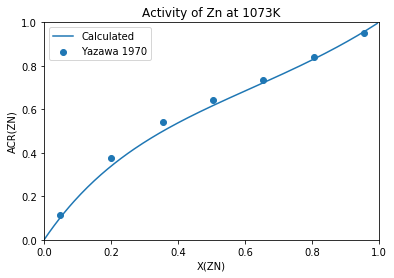

Calculate and Plot Activity
===========================

Given an existing database for Al-Zn, we would like to calculate the
activity of the liquid. In order to make sure we are correct, we'll
compare the values with experimental results.

Set up the database
~~~~~~~~~~~~~~~~~~~

.. code:: ipython3

    from pycalphad import Database, equilibrium, variables as v
    import numpy as np
    
    dbf = Database('alzn_mey.tdb') 
    
    comps = ['AL', 'ZN', 'VA']
    phases = list(dbf.phases.keys())

Calculate the reference state
-----------------------------

You could also include this in the equilibrium calculation in the next
step and select out the point you want, but it might be clear to be more
explicit.

.. code:: ipython3

    ref_eq = equilibrium(dbf, comps, phases, {v.P: 101325, v.T: 1023, v.X('ZN'): 1})

Calculate the equilibria
------------------------

Do the calculation over the compoisition range

.. code:: ipython3

    eq = equilibrium(dbf, comps, phases, {v.P: 1013325, v.T: 1023, v.X('ZN'): (0, 1, 0.005)})

Get the chemical potentials and calculate activity
--------------------------------------------------

We need to select the chemical potentials from the xarray Dataset and
calculate the activity.

.. code:: ipython3

    chempot_ref = ref_eq.MU.sel(component='ZN').squeeze()
    chempot = eq.MU.sel(component='ZN').squeeze()
    
    acr_zn = np.exp((chempot - chempot_ref)/(8.315*1023))

Experimental activity results
-----------------------------

For comparision, we'll add experimental results.

Activties are digtized from Fig 18 in Yazawa, A., & Lee, Y. K. (1970).
Thermodynamic Studies of the Liquid Aluminum Alloy Systems. Transactions
of the Japan Institute of Metals, 11(6), 411–418.
http://doi.org/10.2320/matertrans1960.11.411

The measurements at at 1073 K (the same temperature our calculations
were at) and the reference is the pure components at that temperature.

.. code:: ipython3

    exp_x_zn =   [0.0482, 0.1990, 0.3550, 0.5045, 0.6549, 0.8070, 0.9569]
    exp_acr_zn = [0.1154, 0.3765, 0.5411, 0.6433, 0.7352, 0.8384, 0.9531]

Plot the result
---------------

.. code:: ipython3

    %matplotlib inline
    import matplotlib.pyplot as plt
    
    plt.plot(eq.X.sel(component='ZN', vertex=0).squeeze(), acr_zn, label='Calculated')
    # add experimental data
    plt.scatter(exp_x_zn, exp_acr_zn, label='Yazawa 1970')
    
    plt.xlabel('X(ZN)')
    plt.ylabel('a(ZN)')
    plt.title('Activity of Zn at 1073K')
    plt.legend(loc=0)

.. parsed-literal::

    <matplotlib.legend.Legend at 0x11bcc7898>

