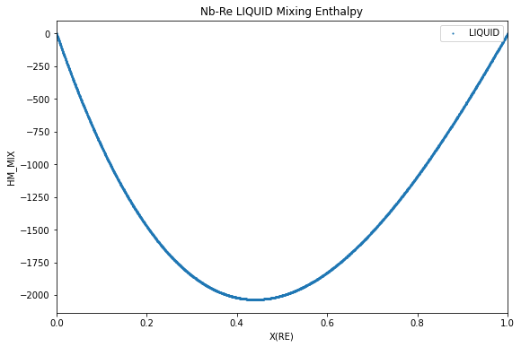
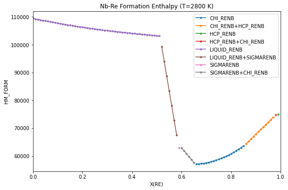
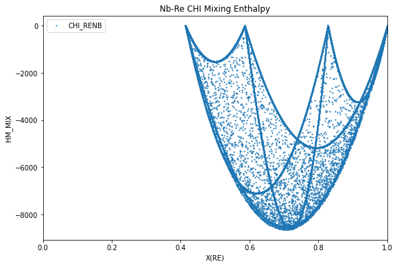

Calculations with Reference States
==================================

Experimental Reference States: Formation and Mixing Energy
----------------------------------------------------------

By default, energies calculated with pycalphad (e.g. ``GM``, ``HM``,
etc.) are the absolute energies as defined in the database and are not
calculated with respect to any reference state.

pycalphad ``Model`` objects allow the reference for the pure components
to be set to arbitrary phases and temperature/pressure conditions
through the ``shift_reference_state`` method, which creates new
properties for the energies that are referenced to the new reference
state, ``GMR``, ``HMR``, ``SMR``, and ``CPMR``.

Enthalpy of mixing
~~~~~~~~~~~~~~~~~~

The enthalpy of mixing in the liquid, analogous to what would be
measured experimentally, is calculated and plotted below with the
reference states of the pure elements both set to the liquid phase. No
temperature and pressure are specified as we would like the reference
state to be calculated with respect to the calculation temperature.

.. code:: ipython3

    %matplotlib inline

.. code:: ipython3

    from pycalphad import Database, calculate, Model, ReferenceState, variables as v
    import matplotlib.pyplot as plt
    
    dbf = Database("nbre_liu.tdb")
    comps = ["NB", "RE", "VA"]
    
    # Create reference states
    Nb_ref = ReferenceState("NB", "LIQUID_RENB")
    Re_ref = ReferenceState("RE", "LIQUID_RENB")
    liq_refstates = [Nb_ref, Re_ref]
    
    # Create the model and shift the reference state
    mod_liq = Model(dbf, comps, "LIQUID_RENB")
    mod_liq.shift_reference_state(liq_refstates, dbf)
    calc_models = {"LIQUID_RENB": mod_liq}
    
    # Calculate HMR for the liquid at 2800 K from X(RE)=0 to X(RE)=1
    conds = {v.P: 101325, v.T: 2800, v.X("RE"): (0, 1, 0.01)}
    result = calculate(dbf, comps, "LIQUID_RENB", P=101325, T=2800, output="HMR", model=calc_models)
    
    # Plot
    fig = plt.figure(figsize=(9,6))
    ax = fig.gca()
    ax.scatter(result.X.sel(component='RE'), result.HMR, marker='.', s=5, label='CHI_RENB')
    ax.set_xlim((0, 1))
    ax.set_xlabel('X(RE)')
    ax.set_ylabel('HM_MIX')
    ax.set_title('Nb-Re CHI Mixing Enthalpy')
    ax.legend()
    plt.show()

Enthalpy of formation - convex hull
~~~~~~~~~~~~~~~~~~~~~~~~~~~~~~~~~~~

Formation enthalpies are often reported in the literature with respect
to the pure elements in their stable phase at 298.15 K. The enthalpy of
formation of the phases in equilibrium, analogous to what would be
measured experimentally, is calculated and plotted below for T=2800 K,
with the reference states of the pure elements both set to the stable
phases and fixed at 298.15 K and 1 atm.

.. code:: ipython3

    from pycalphad import Database, equilibrium, Model, ReferenceState, variables as v
    import matplotlib.pyplot as plt
    import numpy as np
    
    dbf = Database("nbre_liu.tdb")
    comps = ["NB", "RE", "VA"]
    phases = dbf.phases.keys()
    
    # Create reference states
    Nb_ref = ReferenceState("NB", "BCC_RENB", {v.T: 298.15, v.P: 101325})
    Re_ref = ReferenceState("RE", "HCP_RENB", {v.T: 298.15, v.P: 101325})
    
    # Create the models for each phase and shift them all by the same reference states.
    eq_models = {}
    for phase_name in phases:
        mod = Model(dbf, comps, phase_name)
        mod.shift_reference_state([Nb_ref, Re_ref], dbf)
        eq_models[phase_name] = mod
    
    # Calculate HMR at 2800 K from X(RE)=0 to X(RE)=1
    conds = {v.P: 101325, v.T: 2800, v.X("RE"): (0, 1, 0.01)}
    result = equilibrium(dbf, comps, phases, conds, output="HMR", model=eq_models)
    
    # Find the groups of unique phases in equilibrium e.g. [CHI_RENB] and [CHI_RENB, HCP_RENB]
    unique_phase_sets = np.unique(result.Phase.values.squeeze(), axis=0)
    
    # Plot
    fig = plt.figure(figsize=(9,6))
    ax = fig.gca()
    for phase_set in unique_phase_sets:
        label = '+'.join([ph for ph in phase_set if ph != ''])
        # composition indices with the same unique phase
        unique_phase_idx = np.nonzero(np.all(result.Phase.values.squeeze() == phase_set, axis=1))[0]
        masked_result = result.isel(X_RE=unique_phase_idx)
        ax.plot(masked_result.X_RE.squeeze(), masked_result.HMR.squeeze(), marker='.', label=label)
    ax.set_xlim((0, 1))
    ax.set_xlabel('X(RE)')
    ax.set_ylabel('HM_FORM')
    ax.set_title('Nb-Re Formation Enthalpy (T=2800 K)')
    ax.legend()
    plt.show()

Special ``_MIX`` Reference State
--------------------------------

pycalphad also includes special mixing reference state that is
referenced to the endmembers for that phase with the ``_MIX`` suffix
(``GM_MIX``, ``HM_MIX``, ``SM_MIX``, ``CPM_MIX``). This is particularly
useful for seeing how the mixing contributions from physical or excess
models affect the energy. The ``_MIX`` properties are set by default and
no instantiation of ``Model`` objects and calling
``shift_reference_state`` is required.

Below is an example for calculating this endmember-referenced mixing
enthalpy for the :math:`\chi` phase in Nb-Re. Notice that the four
endmembers have a mixing enthalpy of zero.

.. code:: ipython3

    from pycalphad import Database, calculate
    import matplotlib.pyplot as plt
    
    dbf = Database("nbre_liu.tdb")
    comps = ["NB", "RE", "VA"]
    
    # Calculate HMR for the Chi at 2800 K from X(RE)=0 to X(RE)=1
    result = calculate(dbf, comps, "CHI_RENB", P=101325, T=2800, output='HM_MIX')
    
    # Plot
    fig = plt.figure(figsize=(9,6))
    ax = fig.gca()
    ax.scatter(result.X.sel(component='RE'), result.HM_MIX, marker='.', s=5, label='CHI_RENB')
    ax.set_xlim((0, 1))
    ax.set_xlabel('X(RE)')
    ax.set_ylabel('HM_MIX')
    ax.set_title('Nb-Re CHI Mixing Enthalpy')
    ax.legend()
    plt.show()

