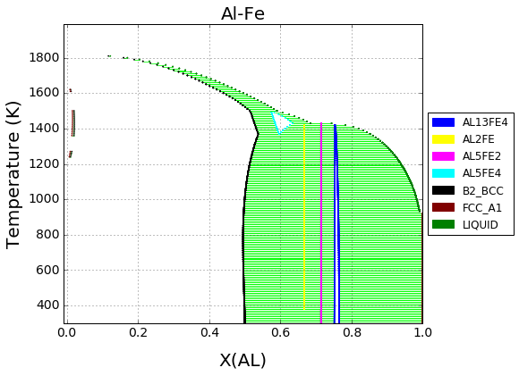

.. pycalphad documentation master file, created by
   sphinx-quickstart on Sat Apr 11 16:58:12 2015.
   You can adapt this file completely to your liking, but it should at least
   contain the root `toctree` directive.

.. |logo| image:: logo.png
          :height: 20pt
          :width: 20pt
          :alt: Logo

|logo| pycalphad: Computational Thermodynamics
==============================================

pycalphad is a Python library for computational thermodynamics using the CALPHAD method. Because pycalphad is still in the alpha phase of development, documentation is a work in progress.

The latest development version of the source code can be found on `GitHub`_.
The newest stable version can be found on `PyPI`_.

.. _GitHub: https://github.com/richardotis/pycalphad
.. _PyPI: https://pypi.python.org/pypi/pycalphad

.. toctree::
   :maxdepth: 2

   INSTALLING
   examples/index
   api/modules
   CHANGES

Acknowledgements
================
Development has been made possible in part through NASA Space Technology Research Fellowship (NSTRF) grant NNX14AL43H, and is supervised by `Prof. Zi-Kui Liu`_ in the `Department of Materials Science and Engineering`_ at the `Pennsylvania State University`_.

.. _Prof. Zi-Kui Liu: http://www.phases.psu.edu/
.. _Department of Materials Science and Engineering: http://matse.psu.edu/
.. _Pennsylvania State University: http://www.psu.edu/

Indices and tables
==================

* :ref:`genindex`
* :ref:`modindex`

