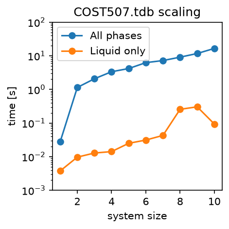

.. title:: FAQ

FAQ
===

What units does PyCalphad use?
------------------------------

PyCalphad uses `pint <https://pint.readthedocs.io>`_ for user-facing unit support.
With pint, PyCalphad's computable property framework supports ``display_units`` that can be overridden and converted with pint.
There are also ``implementation_units`` that cannot be overriden and are as follows:

* All implementation units are SI units.
* Molar quantities are used for state variables, e.g. energy has units ``J/mol``.
* Composition and site occupancies are mole fractions.

Is any parallelism supported in PyCalphad?
------------------------------------------

PyCalphad does not support parallelization out of the box since version 0.8,
however it is possible to use PyCalphad in parallel via multi-processing
packages such as `dask <http://dask.pydata.org/en/latest/>`_.

How long should equilibrium calculations take?
----------------------------------------------

Whenever you create a new ``Workspace`` object and do your first calculation with a database, set of components, and phases, there's some overhead as the code constructions ``Model`` objects and compiles Gibbs energy functions and their necessary derivatives (via SymEngine's lambidfy) to fast machine code that is used throughout PyCalphad's energy minimizer.
Once you pay that one-time overhead and warm the cache with objects, subsequent equilibria are faster to compute.

Performance and scaling depends highly on the system of study, including:

- Number of components (system size)
- Number of phases being considered
- Complexity of the phase models (number of internal degrees of freedom)
- Number of iterations required for the minimizer to find a solution for the given conditions

A simple scaling benchmark based on the COST-507 database is included below.

The benchmark demonstrates scaling in number of components in a scenario where
only one phase is included and one where all the possible phases are included.
The scaling laws in both cases are proportional, but there's a clear jump in
complexity when more phases (and more complicated phases) are included.

If computation time is critical, it is beneficial to remove phases that will be metastable.

.. raw:: html

   

   
<b>Click to see example scaling benchmark code</b>

.. code-block:: python
   :linenos:

   from time import perf_counter
   from importlib.resources import files
   import pandas as pd
   import matplotlib.pyplot as plt
   from pycalphad import Database, Workspace, variables as v
   from pycalphad.core.utils import filter_phases
   import pycalphad.tests.databases

   databases = files(pycalphad.tests.databases)

   REPEATS = 20
   database_filename = "COST507.tdb"
   title = f"{database_filename} scaling"
   filename_prefix = title.replace(" ", "_")
   # sorted by frequency of occurance in ternary assessments
   all_elements = ['AL', 'TI', 'MG', 'CU', 'SI', 'ZN', 'MN', 'SN', 'FE', 'CR']

   db = Database(databases / database_filename)

   data_single_phase = []
   global_phases = ["LIQUID"]
   for system_size in range(1, len(all_elements)+1):
       components = all_elements[:system_size] + ["VA"]
       composition_conditions = {v.X(el): 1/system_size for el in components[1:system_size]}
       # intermediate temperature to encourage single phase with no miscibility gaps
       conditions = {v.P: 101325, v.T: 1200.0, v.N: 1, **composition_conditions}
       phases = filter_phases(db, components, global_phases)
       print(system_size, components, composition_conditions)
       for _ in range(REPEATS):
           wks = Workspace(db, components, phases, conditions)
           tstart = perf_counter()
           wks.get("GM")
           tend = perf_counter()
           data_single_phase.append({"system_size": system_size, "time[s]": tend-tstart, "num_phases": len(phases)})

   data_all_phases = []
   global_phases = list(db.phases.keys())
   for system_size in range(1, len(all_elements)+1):
       components = all_elements[:system_size] + ["VA"]
       composition_conditions = {v.X(el): 1/system_size for el in components[1:system_size]}
       conditions = {v.P: 101325, v.T: 300.0, v.N: 1, **composition_conditions}
       phases = filter_phases(db, components, global_phases)
       print(system_size, components, composition_conditions)
       for _ in range(REPEATS):
           wks = Workspace(db, components, phases, conditions)
           tstart = perf_counter()
           wks.get("GM")
           tend = perf_counter()
           data_all_phases.append({"system_size": system_size, "time[s]": tend-tstart, "num_phases": len(phases)})

   df_all_phases = pd.DataFrame(data_all_phases)
   df_single_phase = pd.DataFrame(data_single_phase)

   df_all_phases.to_csv(filename_prefix + "-all_phases" + ".csv", index=False)
   df_single_phase.to_csv(filename_prefix + "-single_phase" + ".csv", index=False)

   perf_df_all_phases = df_all_phases.groupby(["system_size"]).aggregate("median")
   perf_df_single_phase = df_single_phase.groupby(["system_size"]).aggregate("median")

   # Plot scaling performance in number of components
   fig, ax = plt.subplots(figsize=(3,3))
   perf_df_all_phases.plot(y="time[s]", marker='o', label="All phases", ax=ax)
   perf_df_single_phase.plot(y="time[s]", marker='o', label="Liquid only", ax=ax)
   ax.set_title(title)
   ax.set_yscale("log")
   ax.set_ylabel("time [s]")
   ax.set_xlabel("system size")
   ax.set_ylim(1e-3, 1e2)
   ax.figure.savefig(filename_prefix + ".png", dpi=150, bbox_inches="tight")

.. raw:: html

   

Text is sometimes cut off when saving figures
---------------------------------------------

Occasionally when saving images with the matplotlib function ``plt.savefig``, axis titles and legends are cut off.

This can be fixed:

* Per function call by passing ``bbox_inches='tight'`` keyword argument to ``plt.savefig``
* Locally by running ``import matplotlib as mpl; mpl.rcParams['savefig.bbox'] = 'tight'``
* Permanently by adding ``savefig.bbox : tight`` to your `matplotlibrc file <https://matplotlib.org/users/customizing.html>`_.
